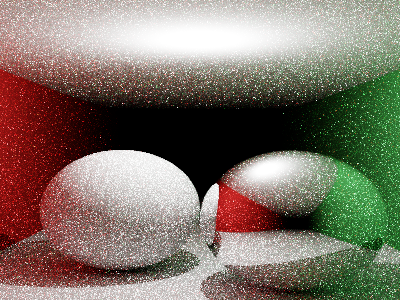

# toyRender

A modular path-tracing test platform written in Zig (≥ 0.14). The goal is to serve as an experimental harness for comparing acceleration structures, geometry representations, and BxDF materials under a unified rendering framework.



## Quick start

```bash
# Prerequisites
# Zig 0.14+  — https://ziglang.org/download/
# SDL2        — apt install libsdl2-dev  |  brew install sdl2

zig build run           # render Cornell box (800×600, 64 spp) → out.png
zig build test          # white furnace + perf counter tests
```

## Features

| Area | What's working |
|---|---|
| **Integrators** | Path tracer (MIS, balance heuristic, Russian roulette), direct lighting, debug views (normals, albedo, depth, UV) |
| **Materials** | Lambertian, perfect specular, GGX microfacet, dielectric (Fresnel-Schlick) |
| **Geometry** | Sphere, plane, triangle mesh (Möller–Trumbore) |
| **Acceleration** | Brute-force linear scan; BVH node/storage defined (build + traversal stubbed) |
| **Cameras** | Pinhole, thin-lens (depth of field) |
| **Lights** | Point, area (sampling stubbed), environment / HDRI (importance sampling stubbed) |
| **Samplers** | Independent (PCG32), Halton (base-2/3) |
| **Film** | Accumulation buffer, ACES / Reinhard / linear tonemapping, sRGB output |
| **Display** | SDL2 progressive preview with live tonemapping |
| **Path viz** | Path segment overlay on film (world→raster projection stubbed) |

All module interfaces use tagged unions — no vtables, no heap dispatch.

## Architecture

11 named modules wired in `build.zig`:

```
math → geometry → accel
                → material
                → light
                → scene → integrator
                        → viz
film  → integrator
      → display
sampler → integrator
```

See [ARCHITECTURE.md](ARCHITECTURE.md) for per-module details, stub status, and a prioritized task list.

## Remaining work (priority order)

1. `Mat4.inverse` — needed for transform instancing
2. BVH SAH build + traversal — replace linear scan
3. OBJ loader + `TriangleMesh.initFromArrays` — load real meshes
4. `Film.writePng` via [zigimg](https://github.com/zigimg/zigimg) — file output
5. JSON scene loader — drive scenes from files
6. `AreaLight.sampleLi` — proper area-light MIS
7. GGX VNDF sampling (Heitz 2018) — fix fireflies at low roughness
8. CLI argument parser
9. Tile-based multi-threading
